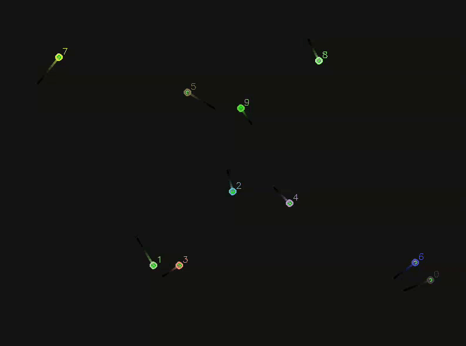

# 🔍 C++ Object Tracking Library

A modular, OpenCV-integrated C++ library for real-time object tracking with support for Kalman and NoFilter-based tracking, visualization, and custom distance metrics.

---

## Features

- Modular tracking pipeline
- Configurable tracker parameters
- Supports Kalman and NoFilter filters
- Visual tracking with trail fading
- Supports re-identification logic
- Testable with synthetic bouncing objects
- Toggleable visualization via config
- Lightweight, OpenCV-based visual debugger

---

## Demo



---

## Dependencies

- CMake (>= 3.10)
- OpenCV (>= 4.0)
- Eigen3 (>= 3.3)
- GCC/G++ (>= 11)

---

## Build Instructions

```bash
    git clone https://github.com/zneave/TrackingLibrary.git
    cd TrackingLibrary
    mkdir build && cd build
    cmake ..
    make
```

---

## Running the Example

```bash
    ./example_tracker
```

---

## License

MIT License